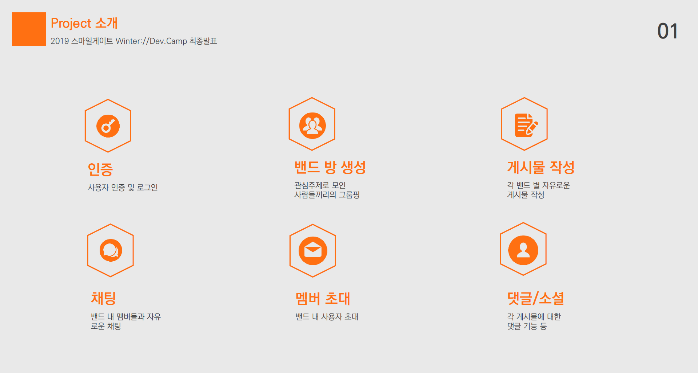

# Band형 그룹핑 SNS 서비스 - SIG

------

#### Smilegate Winter Dev Camp

- 팀명 : JustCoding
- 개발기간 :  2019년 1월 14일 ~ 2019년 2월 26일
- 소개: SIG는 Special Interest Group의 약자로 특정 주제에 관심이 있는 사람들끼리의 모임을 위한 SNS 서비스 라는 뜻을 담았다. 네이버의 Band 서비스를 모방하여 서비스의 주요 기능과 특징을 가져왔다. 주요 기능으로는 밴드 방 생성, 친구 초대, 글 및 댓글 작성, 채팅 등이 있다. 백앤드는 Django, 프론트 앤드는 Vue.js를 활용하였다. 

------

## 주요기능

 

## 폴더 구조

#### - 서버(Backend)

- Backend/AuthServer : **인증서버** - 로그인/로그아웃, 마이페이지
- Backend/ChatServer : **채팅서버** - 사용자 채팅서비스
- Backend/FileServer : **파일서버** - 파일저장
- Backend/PlatformServer : **플랫폼 서버** - 밴드 방 생성, 글 쓰기

#### - 프론트(Frontend)

- Frontend/src/componets : vue components 위치

#### - 자료

- /doc : 발표자료
- /data : 이미지

#### - 설치 패키지

- /requirements.txt

-----

# Server Architecture

![![server_achitecture]](data/server_achitecture.png)

## 서버 별 소개

- **File Server(파일서버)** 
  - 이미지 업로드
  - 캐시저장
- **Chat Server(채팅서버)**
  - 각 밴드의 전체 채팅방 : 밴드당 전체 멤버 채팅 한 개 기본 개설
  - 1:1 채팅 : 밴드 내 멤버와의 개인 채팅
- **Auth Server(인증 서버)**
  - 회원가입 : 회원의 정보를 입력 받아 DB에 저장
  - 로그인/로그아웃 : 로그인 인증
- **Platform Server(플랫폼 서버)**
  - 게시물 작성 : 사진, 영상, 파일 업로드가 가능한 게시물 작성
  - 피드 : 각 밴드 내 게시물을 최신순으로 보여줌
  - 댓글 : 밴드 멤버 들이 게시물에 댓글 게시
  - 밴드 개설
  - 밴드 사용자 초대 : 링크 이용
  - 밴드 멤버 확인 : 밴드 멤버 별 소속 멤버 리스트

## 개발 환경& 프레임워크

- mysql
- Django
- Django Channels
- Django Restframework
- vue.js
- 

 

## 사용모듈

## 배포 

 

## Contributor

- [이정호](https://github.com/publicejh) : Chat Server, File Server 개발, 해당 서버 vue front 개발, 인프라 구축

- [이지영](https://github.com/jiyoung1202) : Platform Server 개발, 해당 서버 vue front 개발, DB 스키마 설계

- [송이현](https://github.com/Ihyun) : Auth Server 개발, 해당 서버 vue front 개발. 에러코드 정리

## 시연영상
https://youtu.be/KkDzQ6pFlMw
